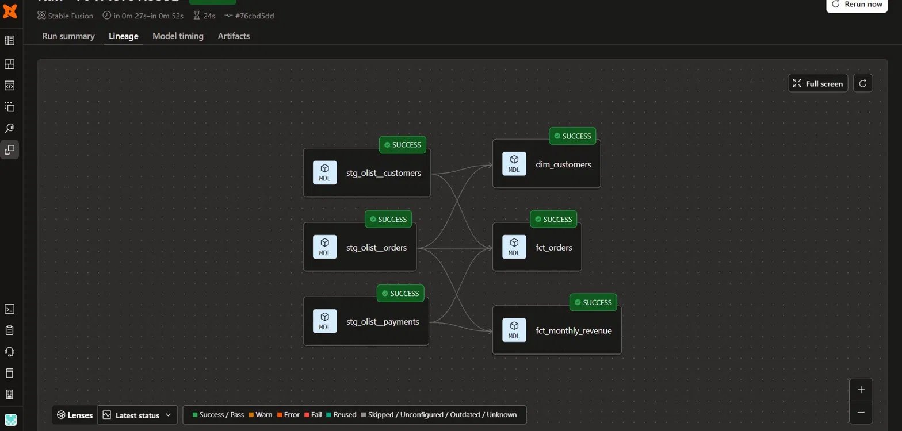
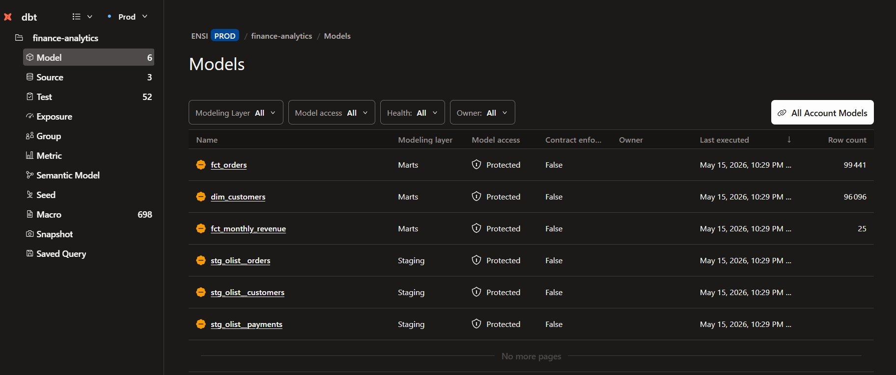
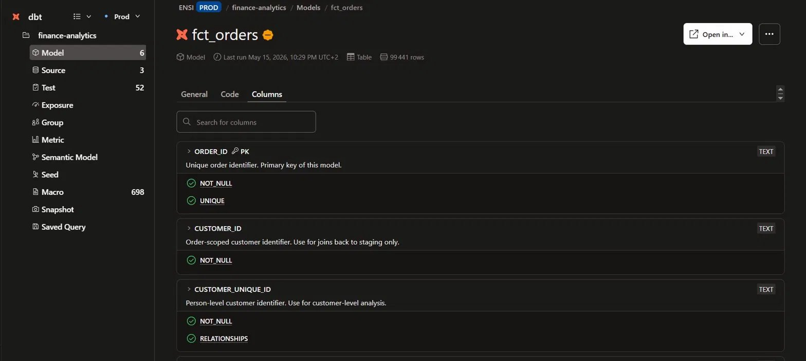
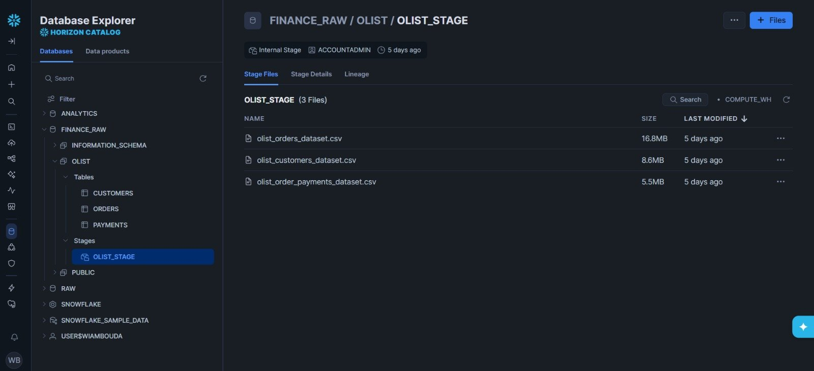

# dbt Finance Analytics - Olist E-Commerce Pipeline

This is a personal project I built to explore the modern data stack, specifically dbt and Snowflake, which are widely used in enterprise data consulting projects.
The goal was simple: take a real messy dataset, profile it properly, clean it, and build a Gold layer ready for BI - the way it would be done in a real data team.

---

## Stack

| Tool | Role |
|---|---|
| **Snowflake** | Cloud data warehouse - Bronze layer |
| **dbt Cloud** | Transformations, testing, documentation |
| **dbt-utils** | Extended tests (accepted_range, unique_combination_of_columns) |
| **SQL** | Data profiling before any transformation |

---

## Dataset

[Olist Brazilian E-Commerce](https://www.kaggle.com/datasets/olistbr/brazilian-ecommerce) - real transactional data from a Brazilian marketplace.

- 99,441 orders
- 103,886 payment records
- 96,096 unique customers
- Period: 2016 to 2018

I chose a finance-oriented dataset because it gives realistic data quality problems - duplicate payment methods per order, inconsistent timestamps, missing values - the kind of issues you actually deal with in production.

---

## Architecture

```
Bronze                        Silver                        Gold
──────────────────────        ──────────────────────        ──────────────────────
finance_raw.olist             dbt staging layer             dbt marts layer

orders.csv        ──────►  stg_olist__orders     ──────►  fct_orders
payments.csv      ──────►  stg_olist__payments   ──────►  fct_monthly_revenue
customers.csv     ──────►  stg_olist__customers  ──────►  dim_customers
```

**Bronze** - Raw CSV files loaded into Snowflake via internal stage. No transformations, exactly as received.

**Silver** - Staging models that clean, rename, and flag data quality issues. One model per source table. Materialized as views.

**Gold** - Business-ready marts. Joins resolved, payments aggregated to prevent fanout, revenue calculations cleaned. Materialized as tables.

---

## Lineage Graph



---

## Step 1 - Data Profiling (Before Writing Any dbt Code)

Before touching dbt I profiled all 3 source tables directly in Snowflake. I wanted to understand what I was working with before deciding what to clean.

The profiling SQL files are in `/analyses`:
- `eda_olist_orders.sql`
- `eda_olist_payments.sql`
- `eda_olist_customers.sql`

The findings are documented in [`data_quality_report.md`](data_quality_report.md).

### Key issues found

| Table | Issue | Rows affected | Decision |
|---|---|---|---|
| orders | Timestamps out of logical sequence (approved after delivery) | 1,382 | Flag with `is_date_sequence_valid` |
| orders | NULL delivery dates on `delivered` status orders | 8 | Flag with `is_null_delivery_consistent` |
| payments | `not_defined` payment type | 3 | Reclassify to `unknown` in staging |
| payments | Zero-value payments | 9 | Confirmed vouchers - keep but flag |
| customers | ZIP codes missing leading zero (stored as integer) | Several | Fix with `LPAD(zip, 5, '0')` |

The rule I followed: **never delete rows in staging, always flag**. The Gold layer decides what to exclude.

---

## Step 2 - Silver Layer (Staging Models)

Three staging models, one per source table.

### `stg_olist__orders`

The most complex staging model. Uses a 3-CTE pattern:

```
source → renamed → quality_flags
```

- `source` - raw data as-is
- `renamed` - column renames to snake_case, `LOWER(order_status)`, calculates `days_to_deliver`
- `quality_flags` - reads from renamed so flags run on already-cleaned data

Two quality flags added:
- `is_date_sequence_valid` - false when timestamps are out of order
- `is_null_delivery_consistent` - false when a NULL timestamp doesn't match the order status

### `stg_olist__customers`

Two decisions driven directly by EDA findings:
- `LPAD(CAST(customer_zip_code_prefix AS VARCHAR), 5, '0')` - restores leading zeros lost when stored as integer
- `LOWER(TRIM(customer_city))` / `UPPER(TRIM(customer_state))` - Brazilian state codes (SP, RJ) are always uppercase by convention

Important distinction preserved:
- `customer_id` = one per order (use for joins)
- `customer_unique_id` = one per real person (use for retention, LTV)

### `stg_olist__payments`

Two transformations from EDA:
- `not_defined` → `unknown` for payment type
- `is_payment_value_valid` flag - false when payment_value < 0, or when payment_value = 0 and payment_type is not a voucher

The composite primary key `(order_id, payment_sequential)` is defined and tested here - `order_id` alone is not unique because one order can have multiple payment methods.

---

## Step 3 - Gold Layer (Marts)

### `dim_customers`
**Grain: one row per `customer_unique_id` (real person)**

The Olist dataset has a known quirk: one person can have multiple `customer_id` values (one per order). This model resolves that to the person level using `customer_unique_id`.

For address, I used `QUALIFY ROW_NUMBER() OVER (PARTITION BY customer_unique_id ORDER BY order_purchase_timestamp DESC) = 1` to get the most recent order's address.

Key columns: `total_orders`, `first_order_date`, `last_order_date`, `is_repeat_customer`

---

### `fct_orders`
**Grain: one row per `order_id`**

The most important modeling decision here: payments are aggregated to order grain before joining to orders.

Why: one order can have multiple payments (credit card + voucher). If you join first and aggregate later, you get fanout - multiple rows per order, which corrupts any revenue calculation.

```sql
-- Aggregate payments first, THEN join
payments_agg as (
    select
        order_id,
        sum(payment_value)       as total_payment_amount,
        max_by(payment_type, payment_value) as payment_type_primary,
        boolor_agg(not is_payment_value_valid) as has_invalid_payment
    from stg_olist__payments
    group by 1
)
```

All quality flags from staging are preserved so BI consumers can filter as needed.

---

### `fct_monthly_revenue`
**Grain: one row per calendar month (25 rows total)**

Revenue calculation uses only valid, non-zero payments - invalid rows and zero-value vouchers are excluded at the source before any aggregation.

```sql
where is_payment_value_valid = true
  and payment_value > 0
```

This makes the model safe to query for financial reporting without additional filtering. Includes payment method breakdown (credit card, boleto, voucher, debit card) as both absolute revenue and percentage share.

---

## dbt build Results

58 tests - 0 errors - 0 warnings


Tests cover:
- `not_null` and `unique` on all primary keys
- `accepted_values` on `order_status` and `payment_type`
- `relationships` between Gold models and staging
- `dbt_utils.accepted_range` on payment amounts and installments
- `dbt_utils.unique_combination_of_columns` on payments composite key

---

## Models in Production



---

## Column-level Documentation

Every column has a description and at least one test. Example from `fct_orders`:



---

## Snowflake Bronze Layer



---

## How to Run

```bash
# Install packages
dbt deps

# Run everything (models + tests)
dbt build

# Run staging layer only
dbt build --select staging

# Run Gold layer only
dbt build --select marts

# Generate and serve documentation
dbt docs generate
dbt docs serve
```

---

## What I Learned

This project taught me things that tutorials don't cover:

- **Grain definition before writing SQL** - you have to know what one row represents before you start, not after
- **Fanout is silent** - a join that multiplies rows doesn't throw an error, it just gives you wrong numbers
- **Flags over deletes** - staging should never remove rows, only flag them and let the Gold layer decide
- **Composite keys** - `order_id` alone is not always a primary key. Understanding why required reading the actual data
- **`QUALIFY` in Snowflake** - more efficient than a subquery for deduplication within partitions
- **Documentation is part of the model** - a column without a description is a column nobody will use correctly

